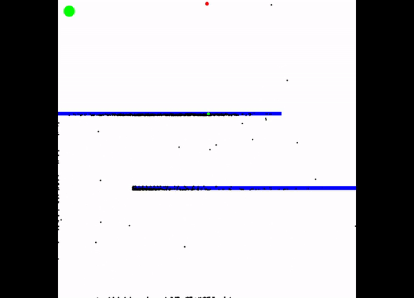

# Path Finding using Genetic Algorithm

This program aims to solve the path finding problem in a maze using the Genetic Algorithm. The visualization is done using processing.



## Usage

You must run the simulation by opening ```Genetic_Algorithm_Visualization.pde``` with [Processing IDE](https://processing.org/).

The button in the top left corner pauses the visualization and causes the simulation to run in the background, allowing the generations to evolve faster! You can resume the visualization using the same button.